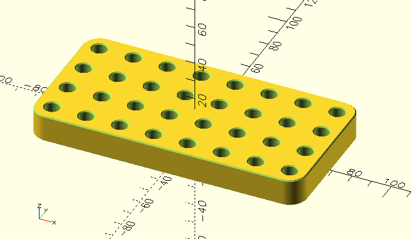

# 晾哨架

\[[以中文阅读](README_CN.md) | [Read in English](README.md)\]

参数化的双簧管、巴松、英国管哨片晾哨架 3D 模型。模型使用 [OpenSCAD](https://openscad.org/) 建模，主要针对 3D 打印。

## 种类

### 内嵌式晾哨架

内嵌式晾哨架通过内嵌的哨座槽放置哨片。这种晾哨架便于存放和携带，但不支持巴松哨片。详见 `recessed_reed_rack.scad`。

